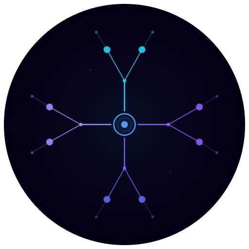

<p align="center">
  
</p>

<h1 align="center">SkillRoot</h1>

<p align="center">
  <strong>A cryptographic primitive for human capability signaling.</strong>
</p>

<p align="center">
  <a href="https://app-nine-rho-70.vercel.app"></a>
  <a href="LICENSE"></a>
  
  
  
  
  
</p>

<p align="center">
  Prove a skill with zero-knowledge proofs. A 24-hour fraud-proof window lets any bonded staker challenge the claim; absent a valid fraud proof, the claim auto-finalizes into a permanent, decayed on-chain skill score readable by any dApp &mdash; no credentials, no gatekeepers, no universities.
</p>

---

## 3D Silk Frontend

> Glassmorphism interface with real-time 3D skill visualization. Three.js + React Three Fiber + Framer Motion on a void-black canvas with electric neon accents.

<p align="center">
  <!-- Screenshot placeholder — replace after first build: pnpm dev → browser screenshot -->
  
</p>

<table>
<tr>
<td width="50%">

<!-- Screenshot placeholder -->

<p align="center"><em>Submit attestation &mdash; glass form with drag-drop proof upload</em></p>

</td>
<td width="50%">

<!-- Screenshot placeholder -->

<p align="center"><em>Skill identity &mdash; 3D node graph with decayed score bars</em></p>

</td>
</tr>
</table>

- **3D Skill Graph** &mdash; floating domain nodes orbit a central protocol identity in a Three.js scene
- **Glassmorphism** &mdash; heavy frosted-glass surfaces with animated conic-gradient borders
- **Silk Palette** &mdash; void black `#030014` &rarr; electric cyan `#22d3ee` &rarr; violet `#8b5cf6`
- **Particle Systems** &mdash; ambient star-field particles with organic drift motion
- **60fps Motion** &mdash; Framer Motion staggered entrance choreography throughout

---

## How It Works

```
Claimant                  Protocol                    Readers
─────────                 ────────                    ───────
  │
  │  1. solve challenge    ┌──────────────────┐
  │  ──────────────────►   │ Groth16 ZK Proof │
  │                        └────────┬─────────┘
  │  2. submit + bond               │
  │  ──────────────────►   ┌────────▼─────────┐
  │                        │ AttestationEngine │
  │                        │  verify proof     │
  │                        │  lock 100 SKR     │
  │                        └────────┬─────────┘
  │                                 │
  │                        ┌────────▼─────────┐
  │                        │  24h Fraud Window │
  │                        │  bonded stakers   │
  │                        │  may submit proof │
  │                        └────────┬─────────┘
  │                                 │
  │                        ┌────────▼─────────┐
  │  3. skill recorded     │ AttestationStore  │──────►  dApps
  │  ◄──────────────────   │  decayed scores   │──────►  wallets
  │                        └──────────────────┘──────►  protocols
```

If a valid fraud proof lands inside the 24h window, the claim is rejected, half the claimant's bond rewards the prover, half is burned. If the window closes with no successful fraud proof, anyone may finalize and the bond is returned to the claimant.

## Architecture

v0.2.0-no-vote ships **8 canonical contracts**. Governance, Sortition, MathVerifier, and ForgeGuard from the earlier draft have been removed — the fraud-proof + auto-finalize flow replaces the committee entirely.

| Layer | Component | What It Does |
|-------|-----------|-------------|
| **Token** | `SKRToken.sol` | Fixed 100M ERC20 supply (ERC20Votes base kept for future governance). No inflation. Slashing burns to `0xdead`. |
| **Staking** | `StakingVault.sol` | Bond / unbond / slash. 1000 SKR minimum. 14-day unbond delay. Gates who may submit fraud proofs. |
| **Challenges** | `ChallengeRegistry.sol` | Bonded proposal + permissionless rejection / activation after an inactivity window. No governance vote. |
| **Engine** | `AttestationEngine.sol` | `submitClaim` → 24h fraud window → `submitFraudProof` **or** `finalizeClaim`. D2 on-chain binding. |
| **Storage** | `AttestationStore.sol` | Permanent attestation records with time-decayed score computation. |
| **Gateway** | `QueryGateway.sol` | Single `verify(address)` returns `uint256[4]` domain scores for any reader. |
| **Claim ZK** | `math.circom` + `MathGroth16Verifier` | Proves knowledge of `(base, exp)` satisfying `base^exp mod N = result`. |
| **Fraud ZK** | `fraud.circom` + `FraudGroth16Verifier` + `FraudVerifierAdapter` | Groth16 fraud circuit; adapter wires the raw verifier to the engine's `IZKVerifier` interface. |
| **Frontend** | Next.js 14 + Three.js | 3D silk glassmorphism dApp. Static export. |
| **CLI** | `skr` | TypeScript CLI: `solve`, `submit`, `dispute`, `query`, `stake`, `challenges`. |

## Monorepo Layout

```
contracts/    Foundry / Solidity 0.8.24 smart contracts
circuits/     Circom 2 + snarkjs Groth16 circuits (math + fraud)
app/          Next.js 14 + Three.js + R3F — 3D silk glassmorphism frontend (static export)
cli/          TypeScript CLI (skr)
docs/         Architecture, contracts, circuits, tokenomics, threat model, roadmap
scripts/      Automation (setup, build, deploy, verify)
```

## Base Sepolia Deployment (v0.2.0-no-vote)

All contracts are live on **Base Sepolia** (chain 84532). Frontend: [app-nine-rho-70.vercel.app](https://app-nine-rho-70.vercel.app)

| Contract | Address |
|----------|---------|
| SKRToken              | [`0xebEB1dAC3F774b47e28844D1493758838D8463B2`](https://sepolia.basescan.org/address/0xebEB1dAC3F774b47e28844D1493758838D8463B2) |
| StakingVault          | [`0x8CCdc62e5762f89d0D17fc5e55Ae3555c207Ad6b`](https://sepolia.basescan.org/address/0x8CCdc62e5762f89d0D17fc5e55Ae3555c207Ad6b) |
| AttestationStore      | [`0x3b6a969DCAD3d79164dA2AD75c2191350BF536a8`](https://sepolia.basescan.org/address/0x3b6a969DCAD3d79164dA2AD75c2191350BF536a8) |
| ChallengeRegistry     | [`0xbD13B7822bBc4cC6C0C53CA08497643C6085294B`](https://sepolia.basescan.org/address/0xbD13B7822bBc4cC6C0C53CA08497643C6085294B) |
| AttestationEngine     | [`0xF2541F68f47f5aB978979B5Ab766f08750d915e8`](https://sepolia.basescan.org/address/0xF2541F68f47f5aB978979B5Ab766f08750d915e8) |
| QueryGateway          | [`0xe4A4c37B59F29807840b1DB22C45C66dcB5D01A2`](https://sepolia.basescan.org/address/0xe4A4c37B59F29807840b1DB22C45C66dcB5D01A2) |
| MathGroth16Verifier   | [`0x8176831054075DaF6B26783491a04D3C14eFD41b`](https://sepolia.basescan.org/address/0x8176831054075DaF6B26783491a04D3C14eFD41b) |
| MathVerifierAdapter   | [`0xde605f7BA61030916136f079731260B76bE8074C`](https://sepolia.basescan.org/address/0xde605f7BA61030916136f079731260B76bE8074C) |
| FraudGroth16Verifier  | [`0x1E39641eaf3930d19F8619184aE10b4f38a5a5bB`](https://sepolia.basescan.org/address/0x1E39641eaf3930d19F8619184aE10b4f38a5a5bB) |
| FraudVerifierAdapter  | [`0x173241d25feb42EA8D9D3D4c767788c6F23C62A7`](https://sepolia.basescan.org/address/0x173241d25feb42EA8D9D3D4c767788c6F23C62A7) |

Deployer `0x709a38C670f15E0E1763A7F42F616526F4e62118` — genesis key burned after deployment. Challenge #1 (APPLIED_MATH &mdash; modular exponentiation) is **ACTIVE**. Full manifest: [`deployments/base-sepolia.json`](deployments/base-sepolia.json).

### First live attestation (v0.2.0-no-vote)

The first on-chain claim under the fraud-proof flow:

| Field | Value |
|-------|-------|
| Challenge | APPLIED_MATH #1 — `3^7 mod 13 = 3` |
| Proof | Groth16, verified on-chain by `MathGroth16Verifier` |
| Bond | 100 SKR locked at `submitClaim`, returned on auto-finalize |
| Fraud window | 24h — closed with no challenge |
| Submission tx | [`0xb6b7d1bd60871bfccd1b3a4f4d0fcb24f7af1beaf2903d0f3391f68c481835a9`](https://sepolia.basescan.org/tx/0xb6b7d1bd60871bfccd1b3a4f4d0fcb24f7af1beaf2903d0f3391f68c481835a9) |
| Block | 40292380 |
| Status | `FINALIZED_ACCEPT` |
| Proof artifacts | [`proofs/input-1.json`](proofs/input-1.json), [`proofs/calldata-1.json`](proofs/calldata-1.json) |

Reproduce end-to-end with the CLI: `skr solve` → `skr submit` → wait 24h → `skr finalize`. See [`docs/TESTNET_FIRST_ATTESTATION.md`](docs/TESTNET_FIRST_ATTESTATION.md) for the manual walkthrough and [`docs/first-attestation.md`](docs/first-attestation.md) for the attestation receipt.

## Quickstart

```bash
# 1. Clone and install
git clone https://github.com/SativusCrocus/SkillRoot.git
cd SkillRoot
./scripts/setup.sh          # idempotent toolchain install (foundry, circom, snarkjs, node)
pnpm install                # workspace dependencies (includes three.js / R3F)

# 2. Build everything
forge build --root contracts
./scripts/build-circuits.sh  # math + fraud circuits → verifier contracts

# 3. Test
forge test --root contracts -vvv

# 4. Start the 3D frontend
pnpm dev                    # → http://localhost:3000
```

## Skill Domains

v0 ships one active circuit. The contract layer supports four domain slots:

| Domain | Circuit | Statement | Status |
|--------|---------|-----------|--------|
| `APPLIED_MATH` | `math.circom` | Modular exponentiation: prove `base^exp mod N = result` | **Active** |
| `ALGO` | &mdash; | Algorithm correctness under constraint budget | v1 |
| `FORMAL_VER` | &mdash; | SAT instance satisfies committed CNF formula | v1 |
| `SEC_CODE` | &mdash; | Vulnerability pattern detection in committed bytecode | v1 |

## Economics

| Parameter | Value |
|-----------|-------|
| Total supply        | 100,000,000 SKR (fixed, deflationary) |
| Claim bond          | 100 SKR (locked at submit, returned on auto-finalize) |
| Fraud-prove reward  | 50% of claimant bond; remaining 50% burned |
| Minimum stake       | 1,000 SKR (required to submit a fraud proof) |
| Unbond delay        | 14 days |
| Fraud window        | 24 hours |

No emissions, no inflation, no investor round, no team vesting, no airdrop. Every rejected claim permanently burns half the bond, so the supply is strictly monotone-decreasing under adversarial behaviour.

## Design Invariants

- Exactly one active ZK claim circuit in v0 &mdash; modular exponentiation
- Fixed 100M SKR supply, no inflation
- Contract-side claimant binding: `bindingHash = keccak256(abi.encode(msg.sender, challengeId)) & (2^248 - 1)`, prepended as public signal 0 for both claim and fraud proofs
- Next.js static export only (IPFS-compatible)
- No committees, no on-chain voting, no governance execution path in v0

## Frontend Stack

| Package | Version | Role |
|---------|---------|------|
| Next.js | 14.2.15 | Static-export framework (`output: 'export'`) |
| Three.js | 0.170.0 | WebGL 3D rendering engine |
| React Three Fiber | 8.17.10 | Declarative Three.js for React |
| Drei | 9.117.0 | R3F helpers (Float, MeshDistortMaterial, environment) |
| Framer Motion | 11.11.11 | Layout animations, entrance choreography |
| Tailwind CSS | 3.4.x | Utility-first CSS with custom silk design tokens |
| wagmi + viem | 2.x | Ethereum wallet connection and contract reads |
| RainbowKit | 2.1.x | Wallet connect modal (themed to silk palette) |

## Documentation

| Document | Contents |
|----------|----------|
| [`docs/architecture.md`](docs/architecture.md) | System topology, component roles, data flow |
| [`docs/contracts.md`](docs/contracts.md) | Contract API reference, storage layout, access control |
| [`docs/circuits.md`](docs/circuits.md) | Circuit constraints, trusted setup, verification |
| [`docs/tokenomics.md`](docs/tokenomics.md) | Supply, bonds, fraud-proof economics |
| [`docs/threat-model.md`](docs/threat-model.md) | Attack surface analysis, risk registry |
| [`docs/ROADMAP.md`](docs/ROADMAP.md) | v1 scope, P0/P1 priorities, research track |
| [`docs/TESTNET_FIRST_ATTESTATION.md`](docs/TESTNET_FIRST_ATTESTATION.md) | First live attestation: record + manual walkthrough |
| [`docs/first-attestation.md`](docs/first-attestation.md) | v0.2.0-no-vote attestation receipt |

## Security

**v0 is testnet-only and unaudited.** Do not use with real value.

Known limitations documented in [`docs/threat-model.md`](docs/threat-model.md):
- Single-party phase 2 trusted setup (v1 requires multi-party ceremony)
- No timelock: no governance pathway exists in v0, but adding one later will require a TimelockController
- Fraud-proof circuit covers only the modexp domain; additional domains require paired fraud circuits

## Contributing

This project is in active development. See [`docs/ROADMAP.md`](docs/ROADMAP.md) for planned work. Issues will be created after the v0 testnet phase has run for 30+ days.

## License

[MIT](LICENSE) &copy; 2026 SkillRoot contributors
